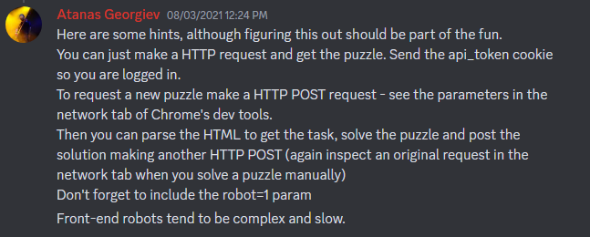

# Puzzle Solver
A collection of algorithmic solvers in Rust for the the [Puzzle Team's puzzles](https://www.puzzles-mobile.com/) (mobile site since they don't really have a home page).

## Progress/TODO

- Able to retrieve puzzles from website
- TODO: Submit puzzle solutions (maybe enter to leaderboards)
- Puzzles in progress
  - Minesweeper (https://www.puzzle-minesweeper.com) (refer to my [python solver](https://github.com/Origamijr/minesweeper-pygame))
- Puzzles in planning
  - Nonogram (https://www.puzzle-nonograms.com/)

## Missing Files

Although I would like to publish all my files, it would seem that part of the fun of this challenge is to figure out how to interface with the website itself. This is the hint from an admin in the puzzle team's discord server.



As such, the following files have been deliberately left out of the repository

```
├── src
│   ├── [puzzle name]
│   │   ├── parse.rs
│   ├── requests
│   │   ├── get_puzzle.rs
│   │   ├── utils.rs
├── test_puzzles
│   ├── [puzzle name]
│   │   ├── [puzzle difficulty].txt
```